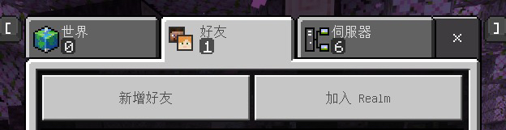

# 主頁
???+ tip "提示"
    哈囉！很高興見到你來到奶茶伺服器！這份 Wiki 整理了不少實用攻略與資訊，希望能幫上你的忙。如果看完還有不懂的地方，或者想找人聊聊，隨時歡迎來我們的 [Discord](https://discord.gg/22DxRjrXRv) 社群發問或交流哦！
    
    如果你熟悉本伺服器的功能，歡迎前往我們的 [GitHub](https://github.com/milkteamc/wiki) 進行修改並開啟 PR，對本項目做出貢獻！
    
    —— [Maoyue](https://maoyue.tw)

!!! question "找不到你要的功能嗎？"
    本 Wiki 尚未收錄完所有伺服器內的功能，對於尚未收錄的功能，請前往我們的 [Discord](https://discord.gg/22DxRjrXRv) 社群詢問。

## 伺服器連線資訊

### Java 版本
!!! info ""
    一般情況下，請使用主要連線位址，無法連線時再來嘗試使用備用連線位址。
    如果依然無法連線，請前往我們的 [Discord](https://discord.gg/22DxRjrXRv) 社群詢問。
- **主要連線位址**：
``` text
milkteamc.org
```
- **備用連線位址**：
``` text
2.milkteamc.org
```
- **支援版本**：`1.17-1.21.5`

### Bedrock 版本
!!! warning "警告"
    基岩版連線有時不太穩定
    
- **連線位址**：
``` text
milkteamc.org
```
- **埠**：
``` text
10147
```
- **支援版本**：`1.21.50-1.21.82`


#### **其他加入伺服器方法：** {#other-connect}
!!! note "注意"
    本方法只適用於 Bedrock 版本

  1. **新增好友**  
     
     
  2. **輸入好友名稱**  
     好友名稱為： 
     ``` text
     milkteamcorg
     ```  
     
     
  3. **點擊加入伺服器！**  
     


## 登入/註冊
!!! warning "注意"
    請妥善保管您的密碼，如果忘記密碼請到我們的 [Discord](https://discord.gg/22DxRjrXRv) 群組中開啟客服單。

!!! danger "警告"
    請使用不容易被猜到的[強密碼](https://zh.wikipedia.org/wiki/%E5%AF%86%E7%A0%81%E5%BC%BA%E5%BA%A6#%E5%BC%BA%E5%AF%86%E7%A0%81)！
    
- 註冊：  
  - 使用方法 `/register [密碼] [確認密碼]`  
  - 例如 `/register 123456 123456`  
- 登入：
  - 使用方法 `/login [密碼]`  
- 更改密碼：  
  - 使用方法 `/changepassword [舊密碼] [新密碼]` 
## 實用基礎指令
- `/spawn` 前往重生點
- `/tpa [玩家]` 向其他玩家發送傳送到該玩家所在位置的請求
- `/tpahere` 向其他玩家發送傳送到自己所在位置的請求
- `/rtp` 隨機傳送
- `/sethome [名稱]` 設定一個家點
- `/home [名稱]` 前往家點
- `/atc` 開關連鎖伐木系統
- `/homes` 開啟家點列表
- `/cheque [金額]` 製作支票
- `/slime` 史萊姆區塊蒐尋器
- `/ping` 顯示自己的延遲
- `/dback` 返回死亡點
- `/back` 返回最後一次傳送點
- `/pay [玩家名稱] [金額]`  **注意**:輸入後須確認(點擊按鈕) 才能順利轉帳
- `/baltop` 顯示金錢排行
- `/ignore [玩家名稱]` 無視玩家
- `/afk` 開始掛機
- `/download` 下載本伺服器專用材質包
