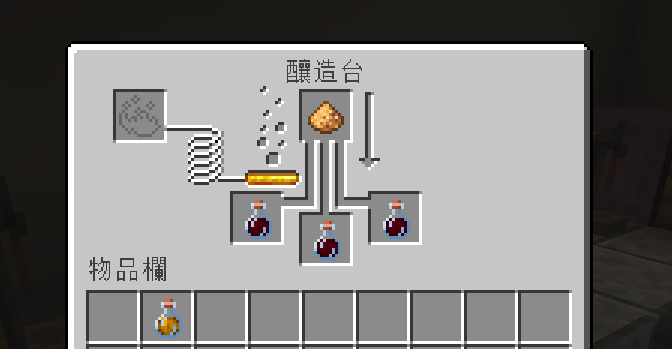

# 酒類製作
!!! warning "尚未完成"
    此頁面還在建置中，這個功能也還未製作完成，歡迎各位提供意見
    
!!! tip ""
    一位好的釀酒師，深知耐心與實驗的重要。留意原料的搭配、蒸餾的火侯與陳釀的木桶，你將能釀造出價值連城、效果獨特的頂級酒品。

## 基礎知識
1. 建造釀造鍋
2. 開始嘗試各種原料
3. 嘗試進行釀造
4. 獲得成品或半成品
5. 有些酒類釀造後只有半成品，繼續進行蒸餾
6. 部分酒類可以繼續進行陳釀
7. 喝下酒品後，可能會有各種不同反應
## 釀造
在鍋釜內裝水，並在下方放上火源（營火、熔岩塊等熱源也可以）  
   
### 釀造鍋使用方式
- 主手拿著原料後，右鍵單擊釀造鍋來添加材料
- 主手拿著時鐘，右鍵點擊釀造鍋來查看釀造時間
- 在合適的時間，使用三個空的玻璃瓶把釀造物撈出來，就能獲得成品或半成品
## 蒸餾
    
在釀造台上方放一個螢石粉（不會被消耗），即成功創建一個蒸餾台。   
將釀造鍋撈出來的三個釀造物，放進蒸餾台當中進行蒸餾，可以嘗試蒸餾多次，可能可以獲得不同的結果。  
## 陳釀
### 木桶製作方式
   
木桶成品如上圖，整體長4格、寬3格、高4格   

- 材料：木柵欄5個、木製樓梯16個、木材18個以及告示牌一個  
- 需在木桶前方放一個告示牌，上面寫「Barrel」（創建成功後可以拆掉）  

如果放置正確，系統會提示已經創建成功。  
### 木桶使用提示
- 把酒放到木桶中開始陳釀
- 陳釀一年的時間等於遊戲中的一天
- 用於製造酒桶的木材類型可能會改變陳釀啤酒的品質
## 酒醉
酒喝多了之後會酒醉，會說話（打字）不清楚、搖搖晃晃地走路以及有暈眩的效果，能使用`/brew info`查看目前酒醉的程度。  
可以使用麵包、牛奶、咖啡等食物解酒。