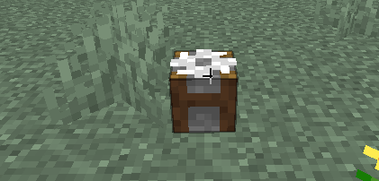

# 回收桶
分解用不到的物品，並取得用於製作它的材料吧！
## 使用方法
### 合成回收桶
只須在工作臺中按照下方配方製作，即可合成回收桶  

### 使用回收桶
只需將回收桶放在地上並且對其右鍵點擊，即可開啟回收桶介面  
  
!!! 注意

    **每次使用回收桶均收費150元**
將要回收的物品放在左方空格後，點右方按鈕，即可獲得分解後的物品
  
分解後的物品直接放回自己的背包中即可  
 