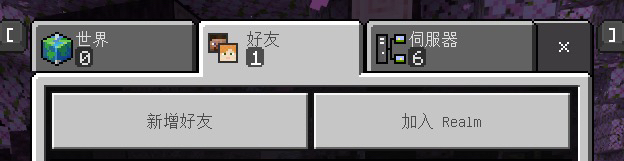
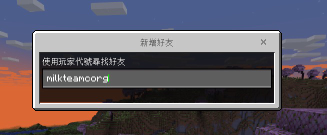
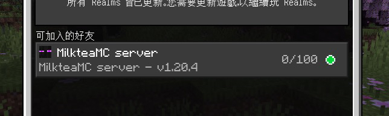

import { Aside, Card, CardGrid, Code, Steps } from '@astrojs/starlight/components';

## Java 版本

<Aside type="note">
一般情況下，請使用主要連線位址，無法連線時再來嘗試使用備用連線位址。
如果依然無法連線，請前往我們的 [Discord](https://discord.gg/22DxRjrXRv) 社群詢問。
</Aside>

<Aside type="caution" title="版本建議">
    1.21.4 以上版本部分材質顯示錯誤，所以建議使用 1.21.1 ~ 1.21.3 版本
</Aside>

<CardGrid>
  <Card title="主要連線位址">
    <Code code="milkteamc.org" lang="text" />
  </Card>
  
  <Card title="備用連線位址">
    <Code code="2.milkteamc.org" lang="text" />
  </Card>
</CardGrid>

**支援版本**：`1.17-1.21.7`

## Bedrock 版本

<Aside type="caution" title="警告">
基岩版連線有時不太穩定
</Aside>

- **連線位址**：
  <Code code="milkteamc.org" lang="text" />

- **埠**：
  <Code code="10147" lang="text" />

- **支援版本**：`1.21.70-1.21.92`

### 其他加入伺服器方法

<Aside type="note">
本方法只適用於 Bedrock 版本
</Aside>

<Steps>

1. **新增好友**  
   

2. **輸入好友名稱**  
   好友名稱為：
   <Code code="milkteamcorg" lang="text" />
   

3. **點擊加入伺服器！**  
   

</Steps>

## 連線問題排除

如果你遇到連線問題，可以嘗試以下解決方案：

<CardGrid>
  <Card title="檢查版本">
    確認你的 Minecraft 版本在支援範圍內
  </Card>
  
  <Card title="嘗試備用位址">
    Java 版本可以嘗試使用備用連線位址
  </Card>
  
  <Card title="檢查網路">
    確認你的網路連線穩定
  </Card>
  
  <Card title="聯絡我們">
    前往 [Discord](https://discord.gg/22DxRjrXRv) 社群尋求協助
  </Card>
</CardGrid>